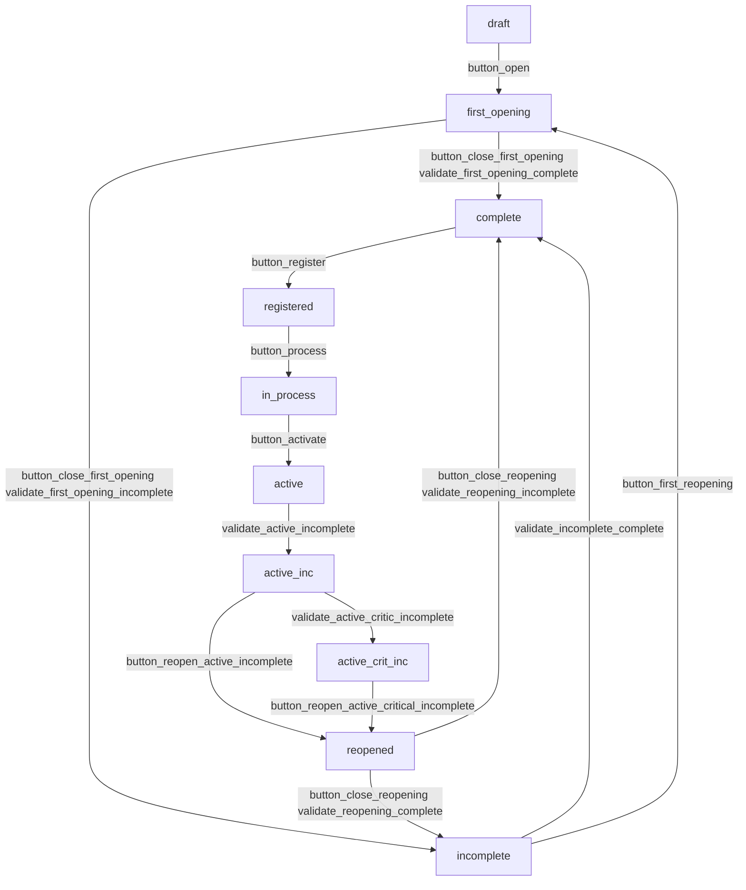

# som_gurb

## Diagrama d'estats d'una agrupació (GURB)


## Diagrama d'estats d'un contracte (CUPS) dins una agrupació (GURB)

```mermaid
graph TD
    act_draft_cups["draft"]
    act_comming_registration["comming_registration"]
    act_comming_modification["comming_modification"]
    act_comming_cancellation["comming_cancellation"]
    act_atr_pending["atr_pending"]
    act_active_cups["active"]
    act_cancel["cancel"]

    act_draft_cups -->|button_create_cups| act_comming_registration
    act_draft_cups -->|button_undo_cups| act_cancel
    act_comming_registration -->|button_activate_cups| act_active_cups
    act_active_cups -->|button_pending_modification| act_comming_modification
    act_comming_modification -->|button_activate_modification| act_active_cups
    act_active_cups -->|button_coming_cancellation| act_comming_cancellation
    act_comming_cancellation -->|button_cancel_cups| act_cancel
    act_comming_cancellation -->|button_discard_comming_cancellation_cups| act_active_cups
    act_cancel -->|button_reactivate_cups| act_comming_registration
    act_active_cups -->|button_atr_pending| act_atr_pending
    act_atr_pending -->|button_reject_atr| act_active_cups
    act_atr_pending -->|button_confirm_atr| act_comming_cancellation
